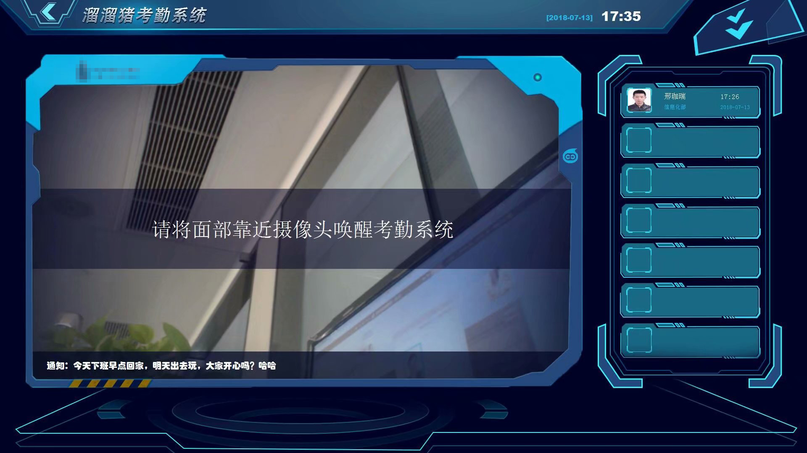

# 人脸识别考勤系统

## 软件商用说明
仅供学习交流及一切非盈利用途，禁止商用。

## 说明
软件的话从去年到现在，一直完美支持100人以上考勤，如果在编译过程中遇到了任何报错，可以给我留言，如果看到的话，我会免费提供解答。
当然啦，也可以给我发邮件：jiarui.xing@foxmail.com。备注：人脸识别考勤。

## 软件打包
软件打包可参考：[Python软件打包教程](https://segmentfault.com/a/1190000009827526 "Python软件打包教程")
提示：关于python打包教程，最近有网友提醒我，我才发现被segmentfault给我隐藏起来了，除了我，其他人都看不见，具体原因不知道为什么，可能是因为我做了个爬虫软件演示吧。因为是几年前写的所以，也就不考虑转移到其他平台了。如果有需要看的，可以私聊我我发原文给你们。

## 效果


## 演示
[演示视频](https://pan.baidu.com/s/19RRy_hT_Xyv9EZ-_BYDTEA "演示视频")


## 使用
```
python3 face.py
```

## 成品打包下载
因为软件打包后有200多兆，传不上来，所以一直没有放打包后的软件。最近有朋友说要成品玩玩，所以就把连接放上来。
百度云：链接: [https://pan.baidu.com/s/1fpw2f7-b2kRe-_jOUNW_Uw](https://pan.baidu.com/s/1fpw2f7-b2kRe-_jOUNW_Uw)  密码: gqne

提示！
成品中我关闭了网络请求，不会从服务器下载照片，以及传送打卡请求，需要增加成员信息，需要作如下更改：
1. 修改或api文件中成员资料信息
2. 修改或新增avatar文件夹中成员照片信息  **（照片命名要和api文件中uid对应）**
这两个问题也是给我发信息的朋友他们在运行代码的过程中问的最多的，要么就是缺少文件，要么就是信息不对。如果没有avatar文件夹，需要新建一个。一定要记住，avatar文件夹中的信息要和./api文件中的信息对应。

## 目录介绍
```
Project
|
+——— avatar -- 头像下载存储
|
+——— audio -- 音频文件下载
|
+——— back -- 打卡成功捕获的画面
|
|——— api -- 本地保留的接口文件
|
|——— config -- 软件接口配置：包含了1.本地更新打卡数据池的时间间隔（refreshconfigtime）；2.签到接口（addsign）；3.读取人脸识别配置接口（faceconfig）；4.打卡用户数据池（userlist）
|
|——— face.py -- 入口文件
|
|——— video.mp4 -- 演示视频
```
